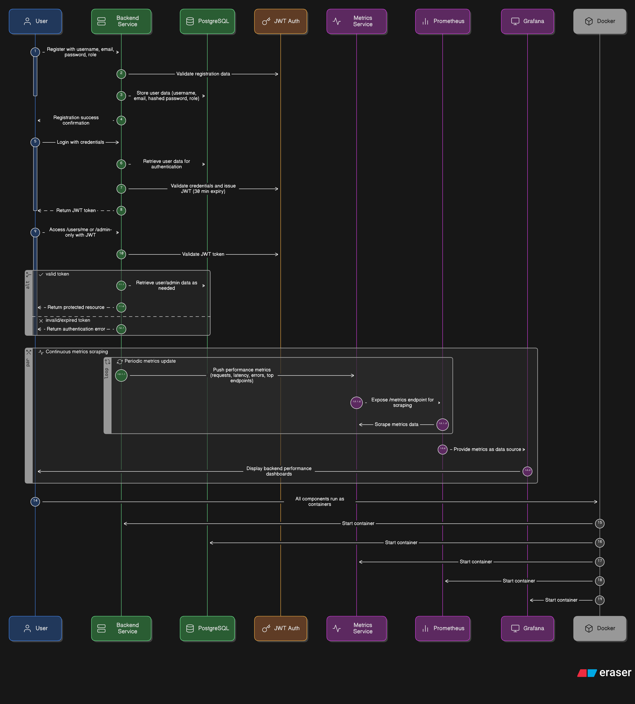
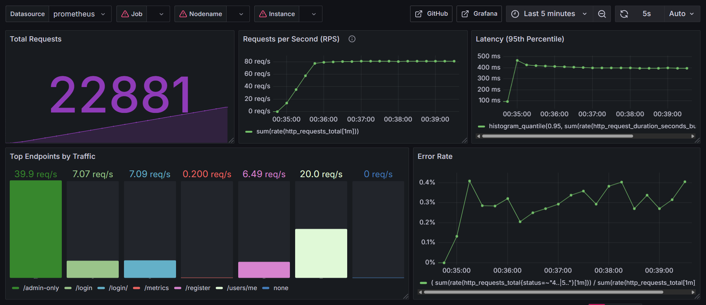

#  FastAuth-RBAC-Sentinel        

**FastAuth-RBAC-Sentinel** is a production-grade authentication and role-based access control (RBAC) system built with **FastAPI**, **OAuth2**, and **JWT**, fully containerized with **Docker** Compose,  — designed for scalability, security, and real-time observability.

Designed with enterprise-grade architecture in mind, this system goes beyond standard authentication by integrating real-time observability using **Prometheus** and **Grafana**, and validating performance under stress through **Locust**-based load testing. 
During high-concurrency simulations, **the system sustained over 22,000+ requests**, **handled peak traffic of 70+ requests/sec, maintained low-latency response times with a 50th percentile at 15ms and a 95th at 340ms, and kept the error rate under 0.4%** — all visualized through live Grafana dashboards.

FastAuth-RBAC-Sentinel is more than just an backend system — it’s a secure, observable, and performance-tested system engineered for reliability and scale.


<!-- A production-grade Authentication & Role-Based Access Control (RBAC) system built with **FastAPI**, **JWT**, and **OAuth2**, featuring real-time metrics monitoring via **Prometheus** & **Grafana** and performance validation through **Locust** load testing.

FastAuth-RBAC-Sentinel is more than just an authentication system — it’s a complete, production-grade backend built for security, scalability, and observability.

What began as a simple FastAPI project to implement secure login and RBAC quickly evolved into a full-fledged backend architecture. With real-time monitoring, performance benchmarking, and load testing, this system now mirrors the robustness expected in enterprise-grade platforms. -->

```
 ⚡ Built from scratch. Battle-tested. Fully observable. Ready for scale.
```

---


## 🧠 System Architecture

The diagram below outlines the complete internal workings of **FastAuth-RBAC-Sentinel**, from secure user registration and JWT-based authentication to real-time observability with Prometheus and Grafana.

- 🔐 **Authentication Flow**: Users register/login securely with credentials; JWT tokens are issued and verified for access to protected endpoints.
- 📦 **Database Layer**: User data is securely stored in PostgreSQL with hashed credentials.
- 🧠 **Role-Based Access Control**: Admin and User roles enforce access restrictions at endpoint level.
- 📊 **Observability Pipeline**: FastAPI exposes metrics via a Prometheus-compatible endpoint; Prometheus scrapes and Grafana visualizes the live metrics.
- 🐳 **Containerized Setup**: Every component is orchestrated using Docker Compose for local development and testing.

This modular, production-grade backend is designed to mimic real-world systems — ensuring **robustness, observability, and scalability**.


<!-- This architecture represents the end-to-end flow of **FastAuth-RBAC-Sentinel**, capturing both authentication logic and production-grade observability. It illustrates:

- 🔐 Secure user registration and JWT-based login flow
- 🧾 Role-based access control for protected endpoints
- 📦 Seamless data storage using PostgreSQL
- 📈 Real-time metrics exposure via Prometheus-compatible FastAPI instrumentation
- 📊 Visual monitoring dashboards powered by Grafana
- 🐳 Fully containerized services using Docker Compose for easy deployment

This unified system design ensures that the application is **secure**, **scalable**, and **observable** — aligning with modern backend engineering principles. -->

---


## 📸 Backend in Action: Grafana Dashboard

### Real-time metrics, traffic simulation, and system behavior under heavy load — all in one glance.



---

## 💡 Feature Highlights

🔐 **Secure JWT-Based Authentication**  
Implements token-based login with OAuth2 and JWT, ensuring stateless and secure user sessions across endpoints.

🧠 **Role-Based Access Control (RBAC)**  
Granular access control for multiple roles (Admin & User) with protected endpoints like `/admin-only`, enforcing permission boundaries.

📈 **Real-Time Metrics & Monitoring**  
Exposes FastAPI metrics such as total requests, request rate (RPS), 95th percentile latency, and error rate via `/metrics`, fully integrated with **Prometheus** and **Grafana** dashboards.

📊 **Production-Grade Observability Stack**  
Includes full observability setup with Grafana panels:
- 📌 **Total Requests**: Over 22,000+ requests served during load tests  
- 🚀 **Peak Throughput**: 70+ Requests/sec sustained  
- ⏱️ **Latency Insights**: 50th percentile = 15ms, 95th percentile = 340ms  
- ❌ **Error Rate**: Under 0.4% even under concurrent load

🐍 **Pythonic Backend with FastAPI**  
Clean, modular codebase using Python, Pydantic models, dependency injection, and async support for scalable API performance.

🧪 **Load Testing with Locust**  
Simulates real-world user traffic with 50+ concurrent users — validating system performance, stability, and error thresholds under stress.

🐳 **Dockerized Microservices Architecture**  
All services (FastAPI app, PostgreSQL, Prometheus, Grafana) run in isolated containers, orchestrated via Docker Compose for reproducible local dev/testing.

---


## 🛠 Tech Stack

| Layer                   | Tools Used                                 |
|-------------------------|--------------------------------------------|
| FastAPI                 | High-performance web framework             |
| JWT & OAuth2            | Token-based secure authentication          |
| PostgreSQL              | Persistent relational DB with pgAdmin GUI  |
| SQLAlchemy              | ORM for database interactions              |
| Docker & Docker Compose | For containerized environment              |
| Prometheus              | Metrics collection                         |
| Grafana                 | Visualization of API health and performance|
| Locust                  | Load testing and performance benchmarking  |
---

---

##  📦 Folder Structure
```
FastAuth-RBAC-Sentinel/
│
├── app/
| ├── __init__.py
| ├── main.py
│ ├── constants.py              # FastAPI app with routing
│ ├── models.py                 # SQLAlchemy models
│ ├── auth.py                   # JWT authentication logic
│ ├── database.py               # DB connection setup
│ ├── schemas.py                # Pydantic schemas
│ └── routers/                  # API routes (login, users) 
|     └── user.py
|     └── admin.py
|     └── login.py 
|
├── data                        # PostgresQL Data Warehouse
|── prometheus.yml              # Prometheus scraping config
│
├── images/                     # Grafana dashboards and Backend images
├── Dockerfile                  # Full stack container setup
├── locustfile.py               # Locust load testing file
├── docker-compose.yaml         # Full stack container setup
├── requirements.txt
└── README.md
```
---

## 🔁 How It Works

**FastAuth-RBAC-Sentinel** is built to mirror production backend systems, combining secure user management with powerful observability.

1. **User Registration & Login**  
   - Users (Admin or Normal) register via `/register` providing `username`, `email`, `password`, and `role`.
   - Authenticated using **OAuth2 Password Flow** with **JWT tokens**.
   - Upon successful login, a **JWT access token** is issued to access protected routes.

2. **Role-Based Access Control**  
   - Each route is protected using dependency injections to validate JWT and extract roles.
   - Admin-only routes (like `/admin-only`) are restricted and throw **401/403** errors if access is unauthorized.

3. **Prometheus Metrics Integration**  
   - All endpoints expose metrics via `/metrics`, collected using Prometheus.
   - Tracked metrics include:
     - Total Requests
     - Requests per Second
     - Latency (P50, P95)
     - Error Rate
     - Per-endpoint traffic volume

4. **Grafana for Real-Time Monitoring**  
   - A detailed Grafana dashboard presents a **live overview of system health**:
     - Traffic spikes, latency bottlenecks, and failure trends are visualized clearly.
     - Useful during both development and production simulation.

5. **Load Testing with Locust**  
   - Simulates realistic traffic with multiple users hitting routes like `/login`, `/users/me`, and `/admin-only`.
   - Performance results used to benchmark latency and stability under heavy load (e.g., 50 users for 5 minutes).


> This system is **modular, testable, monitorable**, and scalable — meeting the key backend engineering pillars.

---

## 🧪 How to Run Locally

1. **Clone the Repository**
   ```bash
   git clone https://github.com/mohdgeelani/FastAuth-RBAC-Sentinel.git
   cd FastAuth-RBAC-Sentinel
   ```
2. **Start Services with Docker**
   ```bash
   docker-compose up --build
   ```
3. **Open the Following Services in Browser**
   - FastAPI Swagger Docs →    http://localhost:8000/docs
   - Prometheus           →    http://localhost:9090
   - Grafana              →    http://localhost:3000
    - In Grafana, login with:
      - Username: admin
      - Password: admin
   - 🐘 PgAdmin → http://localhost:5050
    - In PgAdmin UI, login with
      - Email: admin@example.com
      - Password: adminpass

4. **PostgreSQL Configuration**
 - No .env file required.
 - The database is pre-configured in the codebase.
 ```bash
  ## PostgreSQL (via Docker)
- Host:     db
- Port:     5432
- Database: fastapi_auth
- Username: admin
- Password: adminpass
 ```
> 🛡️ These are default development credentials only and are safe to use locally with Docker. 
> You should always configure secure environment variables when deploying to production.

5. **Run Load Testing with Locust**
```bash
 locust -f locustfile.py --host http://localhost:8000
```
- Open Locust dashboard at:    →   http://localhost:8089
- Configure number of users and spawn rate to simulate traffic.
> ✅ Just clone and run — everything is pre-configured for a smooth developer experience.
>
## 🌟 Final Thoughts

This project began as a simple authentication and RBAC system — but with the ambition to build like real backend engineers do, it evolved into something far more meaningful.
From writing secure APIs to implementing protected routes, running load tests, capturing Prometheus metrics, and building live Grafana dashboards — every component was built, debugged, tested, and tuned by hand.

This isn't just a codebase; it's a backend engineer’s journey of learning through building, breaking, and benchmarking — with every metric earned.

```
                            ⚡ Designed. Tested. Observed. Delivered.
                          🎯 Real traffic. Real metrics. Real experience.  
```
    FastAuth-RBAC-Sentinel is not just a personal project — it's a simulation of production-grade engineering.


      
